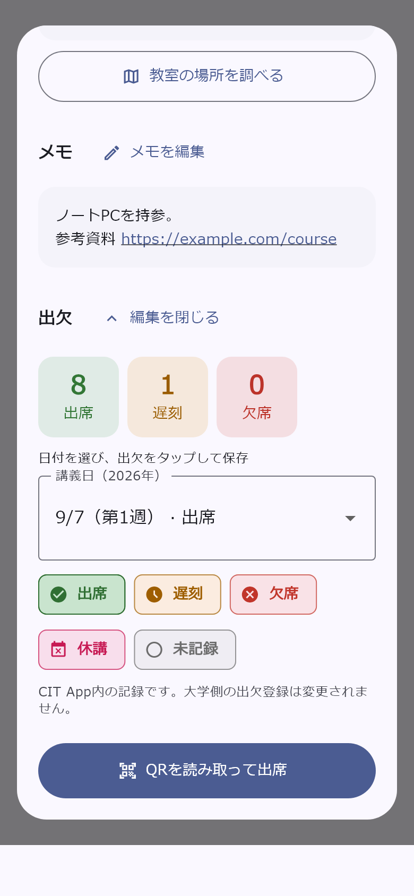
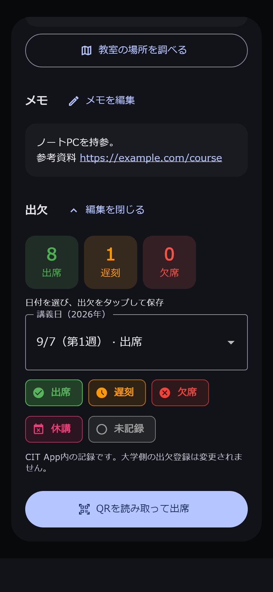

# 講義詳細からの出欠編集

2026-09-16 更新。

## 操作

時間割タブとホームの時間割カードは、共通の `ScheduleClassDetailDialog` で講義詳細を表示する。「出欠を編集」を押すと、同じポップアップ内に講義日の選択と出欠ボタンを表示する。

- 出席は緑、遅刻はオレンジ、欠席は赤。集計・編集ボタン・出欠管理画面で共通のテーマ色を使う。休講はピンク、未記録はグレー。
- 日付と現在の状態を確認し、出欠ボタンをタップすると、その日だけを保存する。「未記録」はその日のCIT App内の記録を消す。
- 初期選択は当日以前で最も近い講義日。学期開始前は最初の講義日を選択する。
- 保存後に集計を再取得する。出欠管理画面も同じFirestoreの記録を参照する。
- 保存中は日付・出欠の二重操作とポップアップを閉じる操作を無効にする。失敗時は変更前の選択を維持し、再操作できる。
- 教室検索、講義メモの編集・URL、従来の条件で表示されるQR出席は維持する。
- ホームでも出欠を直接編集でき、保存後に集計を更新する。対象は選択中の時間割・講義・曜日・開始時限で、ログイン中ユーザーが時間割の所有者の場合に編集できる。
- ホームの時刻・時限表示も時間割タブと同じ計算を使う。単独講義の終了時刻、連続講義、時間割ごとの時刻設定を表示に反映する。
- メモは保存後もポップアップ内に反映する。未保存の変更を閉じるときの確認、保存失敗時の入力保持、文字拡大・キーボード・システムナビゲーションへの対応も両方で共通。

CIT App内の記録を編集する機能で、大学側の出欠登録は変更しない。QRでの出席登録は従来の操作を使う。

## 日程・保存

講義日は出欠管理画面と同じく学期開始日以降の該当曜日を第1週として15週分を作る。講義期間を取得できなければ再読み込みを案内し、開始日が未設定なら編集できる日程がないことを表示する。連続講義は開始時限にまとめる。

対象ユーザー・時間割・期間で記録を取得し、同じ講義IDの記録を優先する。旧形式の記録は曜日と開始時限で照合する。別の講義日・他の時間割・別ユーザーの記録へ変更を広げない。

保存は既存の `AttendanceService.upsertAttendanceStatus` を共用する。旧IDから現在のIDへの置き換えと保存を一括更新し、保存失敗で旧記録だけが消えることを防ぐ。保存に成功した編集状態では旧IDを引き継がず、次の編集で削除済みIDを再利用しない。

主な実装:

- `lib/widgets/schedule/schedule_class_detail_dialog.dart`: 色付き集計、編集の展開、保存中の画面操作制御。
- `lib/widgets/schedule/class_attendance_editor.dart`: 日付選択、保存、エラー表示。
- `lib/widgets/schedule/attendance_status_chip.dart`: 出欠管理画面と共通の色・ラベル・編集ボタン。
- `lib/models/schedule/attendance_session.dart`: 15週の日程、記録の照合。
- `lib/services/schedule/attendance_service.dart`: 取得、保存、旧記録の一括置き換え。
- `lib/widgets/schedule/schedule_grid_widget.dart` と `lib/screens/schedule/schedule_screen.dart`: 対象講義・時間割・ログイン中ユーザーとの接続。
- `lib/screens/home/home_screen.dart`: ホームの時間割カードから共通の講義詳細を開き、メモ・QR出席・出欠編集を同じ保存サービスへ接続する。

## ホームとの共通化の確認（2026-09-16）

ホーム独自の古いダイアログと表示用ヘルパーを削除し、時間割タブと同じ共通部品へ接続した。共通ダイアログと出欠保存サービスの関連テスト17件が成功。ホームの静的解析でエラーはなく、変更箇所以外の既存警告は残る。今回の共通化後の実機操作は未確認。

## 初回実装の検証（2026-09-12）

Flutter全体156件と、最終修正後の出欠関連17件が成功。出欠カード・編集部品・モデル・保存サービス・対象テストの静的解析で指摘なし。既存の時間割画面などには今回の変更箇所以外の解析指摘が残る。

日程の週数と年越し、ユーザー・時間割の分離、旧記録の照合、全状態の保存と未記録への変更、保存失敗時の維持、二重送信防止、集計更新、メモ機能の維持をテストした。ライト／ダーク、幅320px、文字200%、3ボタン操作領域相当の下余白48pxでも編集できる。確認画像は実際の部品にテスト用データを渡し、Meiryoで描画したもの。

| ライト | ダーク |
| --- | --- |
|  |  |

```text
flutter test test/services/schedule/attendance_service_test.dart test/widgets/schedule_class_detail_dialog_test.dart
flutter test test/widgets/schedule_class_detail_dialog_test.dart --dart-define=WIDGET_PREVIEW_DIR=docs/qa/attendance
```

AndroidデバッグAPKのビルドが成功した。実機が未接続のため今回の変更の実機確認は未実施。保存テストは検証用データで行い、実ユーザーの出欠記録は変更していない。
