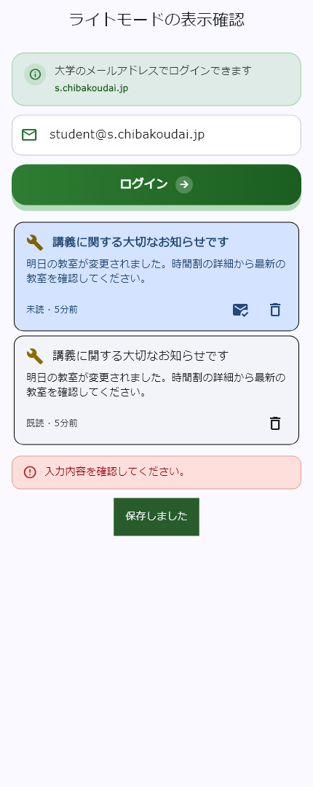
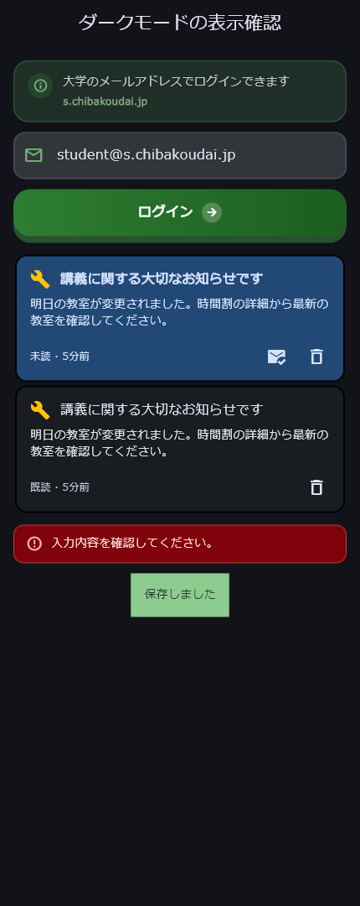
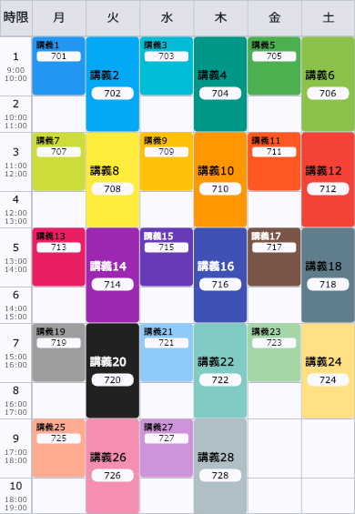
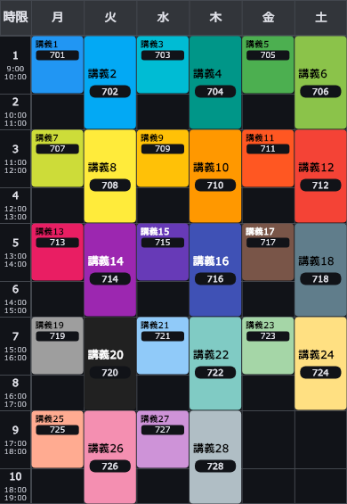

# ライト／ダーク表示の視認性確認

確認日: 2026-09-12

固定の文字色・背景色が原因で、ダークモードの通知、認証画面、掲示板、時間割などに読みにくくなる箇所があったため修正した。ライトモードでも、緑・橙・黄の背景に白い小さな文字を重ねる箇所を修正した。

## 確認範囲

`lib/screens` の109ファイルと `lib/widgets` の72ファイル、共通テーマ、システムナビゲーション領域、通知サービス、Androidのウィジェット8レイアウト・背景リソース、iOSウィジェットの配色定義を確認した。今回追加した通知カードも含む。

これは全画面の配色コードの確認と、主要な表示部品の描画・自動テストを組み合わせた確認である。すべての画面を実機で開いて検証したことを意味しない。

| 対象 | 主な修正・確認内容 | 確認方法 |
| --- | --- | --- |
| 共通テーマ・通知バー・ツールチップ | 背景と文字の対応色を明示。画像ビューアーの白いタイトルを共通AppBarの文字色が上書きする問題を解消 | 配色コード、コントラスト計算、実際の文字描画テスト |
| 個人通知 | 未読カードの背景と本文をテーマに合わせ、既読・未読を文字でも区別。操作ボタンが長い本文を圧迫しない配置へ変更 | 全14種類 × 既読／未読 × ライト／ダーク。幅320px、文字200%、開く・既読・削除のコールバック |
| 全体のお知らせ | 新着件数と重要度バッジの文字色、見出しの折り返し、重要度ラベルの配置を修正 | ホーム部品と一覧画面を幅320px・文字200%で描画。バッジの背景と文字色を計測 |
| ログイン・登録・プロフィール | 緑色の説明文・リンク、案内カード、入力欄、チェックマーク、アバターの文字を調整。ログインボタンの背景を濃くし、拡大文字に合わせて高さを確保 | 認証部品・アバターの両モード描画、ボタン操作、コントラスト計算 |
| 時間割・講義詳細・学年暦 | 講義セルには設定色をそのまま使い、科目名を黒／白から自動選択。教室ラベルはテーマの背景／文字色を使用。選択中のボタンの文字色を修正。時間割の見出しの枠線による2pxのはみ出しを解消 | 時間割の全28色を両モードで描画し、設定色の一致と文字コントラストを確認。既存の講義詳細・学年暦・システム余白のテストも実行 |
| 掲示板・Cwitter・Chiba Channel | コメント背景、カテゴリの選択色、返信・スレ主・リンク・ハンドル名などの固定色を調整 | 配色コード、共通色計算のテスト |
| 学食・バス・電車・地図・便利リンク | 説明文、状態表示、空表示、操作ボタンを調整。地図・写真ビューアーの固定黒背景と白い操作UIは維持 | 配色コード、Androidビルド |
| 問い合わせ・通報・管理画面・デバッグ・規約等 | 灰色の説明文、白固定の入力背景、警告カード、状態ラベル、通知バーを調整 | 配色コード、静的解析、Androidビルド |
| Android通知・ホームウィジェット | 通知用に透明背景の単色アイコンを追加。ウィジェットの昼夜用リソースを分離。週間時間割は講義色から黒／白の文字を選択 | リソース配色の計算、Android APKビルド |
| iOSホームウィジェット | `systemBackground`、`primary`、`secondary` を使う配色を確認 | コード確認のみ。iOS実機・Xcodeでの描画は未確認 |

## 配色の基準と実測

通常文字はコントラスト比4.5:1以上を基準とした。これは [W3Cの文字コントラスト基準](https://www.w3.org/WAI/WCAG21/Understanding/contrast-minimum.html) に沿った数値であり、アプリ全体のWCAG適合認証を示すものではない。

- `AppColors` で、任意の背景に対する文字色と、テーマに適した強調色・淡い背景色を計算する。
- 共通テーマの主要な背景／文字、Materialの基本色・アクセント色、通知カードの実際の文字色をテストした。
- 色付き通知バーは、共通の文字色に対して7:1以上を確保する。
- Androidウィジェットの本文・補足・強調色を、通常・行・空欄・現在講義の4背景に対して計算した最小値は、ライト **5.49:1**、ダーク **6.53:1**。
- Androidの通知アイコンはランチャー画像から専用の単色画像へ変更した。OSの通知表示に合わせた方式は [Androidのアイコン作成資料](https://developer.android.com/studio/write/create-app-icons) を参照。

## 検証結果

- Flutterの全テスト: **103件成功**。今回追加した視認性テスト16件を含む。
- AndroidデバッグAPK: **ビルド成功**。
- 静的解析: **エラー0件**。警告46件・info 418件が残っている。開始時の同じコードに対する474件から464件へ減少し、今回の修正による診断の増加はない。
- 差分の空白チェック: 成功。
- OneDrive配下の生成物ロックを避けるため、テストとビルドはソースを同期した一時作業コピーで実施した。

再確認コマンド:

```text
flutter test
dart analyze lib test/widgets/theme_visibility_test.dart test/support/theme_test_fonts.dart
flutter build apk --debug
```

表示画像は実際の認証・通知部品をFlutterで描画したもの。確認用の日本語フォントにはWindowsのMeiryoを使用しており、本番のNoto Sans JPそのものの字体・字幅を保証する画像ではない。

| ライト | ダーク |
| --- | --- |
|  |  |

### 時間割の色の追加調整（2026-09-12）

講義セルの背景に設定色を12%だけ混ぜていたため、色が淡くなりすぎていた。背景は不透明な設定色をそのまま表示し、科目名には `AppColors.onColor` で黒／白のうち読みやすい文字色を選ぶ。教室名はテーマに応じた独立したラベルで表示する。

全28色 × ライト／ダークで設定色との一致と科目名・教室名のコントラスト比4.5:1以上を確認した。通常講義・連続講義を含む視認性テストと講義詳細テストは計22件成功。以下は実際の時間割部品に確認用データを表示した画像（フォントは上記と同じMeiryo）。

| ライト | ダーク |
| --- | --- |
|  |  |

## 残る実機確認

確認時点でADBに接続されたAndroid実機はなかった。以下は未確認として残す。

1. Android実機で、ライト／ダークを切り替えた際の通知欄・ロック画面・通知バナーと、ホームウィジェットの再表示。
2. iOS実機での通知、ホームウィジェット、拡大文字、iOSのウィジェット着色設定。
3. Firebase上の実データ・権限に依存する全画面の、端末上での一巡確認。

画像に焼き込まれた文字、利用者が投稿した写真、外部Webページの配色はアプリのテーマでは変更できない。これらについては、画像を表示するアプリ側の背景と操作UIを確認対象とした。

## 今後の変更時

文字と背景は `ColorScheme` の対応する組み合わせを使う。独自色のラベルには `AppColors.onColor`、通常の画面上の強調文字には `AppColors.accent` を使う。淡い色のカードには `AppColors.tintedSurface` を使い、ダークモードでも明るい背景だけが残らないようにする。

時間割のように利用者が背景色を選ぶ箇所では、その設定色を保持し、`AppColors.onColor` で文字色を調整する。設定色を `tintedSurface` で薄めない。

通知バーの独自背景には `AppColors.snackBarSurface` を使い、本文・アクション・アイコンは `onInverseSurface` に合わせる。通信処理後に表示する際は、画面がまだ存在することを確認するか、表示前に取得した配色とScaffoldMessengerを利用する。
