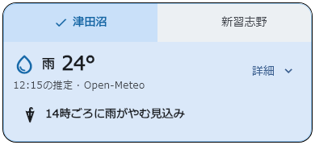
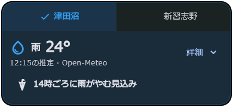
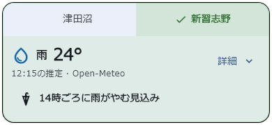
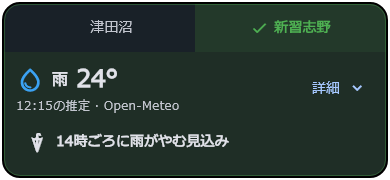
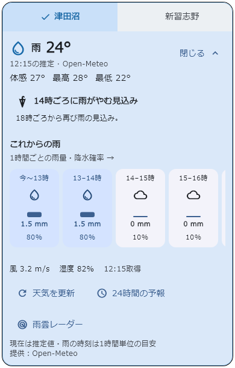
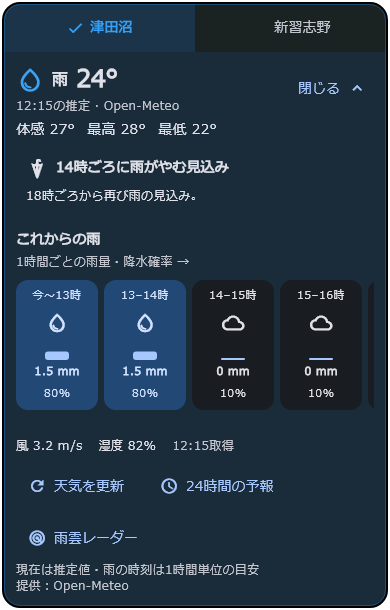

# ホームの天気予報

2026-09-12 更新。

## 利用者に見える内容

- 初期表示は現在の推定天気・気温・予報の対象時刻と、「14時ごろに雨がやむ見込み」など次の雨の変化に絞る。幅390px・標準文字サイズの確認画像では高さ約180px。
- 「詳細」で同じカードを展開し、「閉じる」で元の高さに戻す。体感・最高／最低気温、雨の再開などの補足、12時間分の雨量・降水確率、風速・湿度・取得時刻は展開後に表示する。
- 24時間予報の一覧、天気の更新、キャンパス周辺の[気象庁の雨雲レーダー](https://www.jma.go.jp/bosai/nowc/)も展開後に利用できる。
- キャンパス選択はカード上端の左右分割ボタン。メインキャンパスを左、もう一方を右に配置する。メインが津田沼なら左が津田沼・右が新習志野、メインが新習志野なら逆になる。天気だけを切り替えたときは並び順を変えず、フリップも行わない。テーマ色は新習志野が緑、津田沼が青。学バスの路線色には連動させず、選択欄はテーマ色を20%（未選択は4%）重ねた淡い背景とする。選択に応じてカードの配色も変わり、チェックと文字色でも選択状態が分かる。
- 初期表示の天気はメインキャンパスと一致させる。メインキャンパス設定を変更したら、表示中のカードの並び順と天気にも反映する。天気カードでの切り替えは一時的な閲覧として扱い、メインキャンパス設定は変更しない。旧バージョンが保存した `home_weather_campus_v1` は参照しない。
- 展開中のキャンパス切り替えは展開状態を保つ。新しくカードを開いたときは、メインキャンパスの天気を折りたたんで表示する。
- ホーム全体の更新操作、アプリ復帰時と10分おきの更新は折りたたみ中も動作する。通信エラーと再試行は折りたたみ中も表示する。

| ライト | ダーク |
| --- | --- |
|  |  |

新習志野の選択時:

| ライト | ダーク |
| --- | --- |
|  |  |

展開後:

| ライト | ダーク |
| --- | --- |
|  |  |

画像は実際の部品に確認用の雨天データを渡して描画したもの。確認用フォントはMeiryoで、本番はNoto Sans JP。

## データと雨の判定

取得処理は `lib/services/weather/campus_weather_service.dart`、モデルと雨の見通しは `lib/models/weather/campus_weather.dart`、表示と更新管理は `lib/widgets/home/campus_weather_card.dart` に分離した。ホーム画面は専用部品を配置し、全体の更新操作を転送する。

[Open-Meteo Forecast API](https://open-meteo.com/en/docs) のBest Matchを使用する。従来のJMAモデル固定から、降水確率も取得できる構成に変更した。モデルの観測実況ではないため、現在の天気には「推定」、開始・終了には「ごろ」「見込み」と表示する。日本向けに取得できる15分値は1時間データの補間を含むため、分単位の雨の開始・終了は約束しない。

APIの降水量・降水確率は、時刻ラベルの**直前1時間**を表す。例えば15:00の雨量は14:00〜15:00に対応する。時間帯の天気コードとは区別し、雨の開始・終了が1時間ずれないようにしている。3日分のデータから現在以降を使い、深夜も翌日の予報へ継続する。UNIX時刻をUTCの瞬間として保持し、端末のタイムゾーンにかかわらず日本時間を表示する。

小雨を0.3 mmの閾値で除外する処理は廃止。現在は天気コードと降水量から判定し、時間帯の雨の有無はその時間帯の降水量で判定する。雪と雷雨も区別する。雨量ゼロでも降水確率40%以上の時間帯があれば「可能性あり」と案内し、降ると断定しない。

## 欠損・通信失敗

- 欠けた値を0に変換しない。雨量・確率の欠損は「—」、雨がやむ時刻を判断できなければその旨を表示。
- 連続して取得できた時間帯の範囲だけを案内する。予報の空白をまたいで「雨なし」と判定しない。
- 更新失敗時は、同じキャンパスの前回データと再試行ボタンを表示する。初回失敗時には別キャンパスの天気を流用しない。
- 取得から30分、または現在天気の対象時刻から45分を過ぎたデータは古い予報として表示し、「いま」と呼ばない。
- キャンパス別に進行中の取得をまとめ、遅れて届いた別キャンパスの応答で表示を上書きしない。

## 検証

対象テスト:

2026-09-12のメインキャンパス連動変更では、確認画像の生成を含む天気関連30件が成功した。変更した天気カードとテストの静的解析で指摘なし。ホーム画面には今回の変更箇所以外に既存の警告・情報レベルの指摘14件が残る。

Android StudioからSamsung SM-S928Qへのデバッグビルド・インストール・起動が成功し、実データでコンパクト表示、詳細展開、両キャンパスの配色を確認した。実機はジェスチャーナビゲーション設定で、3ボタン相当の下余白と文字200%は上記のウィジェットテストで検証している。

メインキャンパス連動変更も同じ実機へビルドして反映し、津田沼が左・選択中、新習志野が右になる表示を確認した。両設定の初期表示・変更時の連動はウィジェットテストで検証している。

```text
flutter test test/services/weather test/widgets/home/campus_weather_card_test.dart
```

雨の開始・終了・再開、日付越え、小雨、降水確率、欠損、古いデータ、通信失敗、キャンパス切り替え競合、自動更新を検証。折りたたみ時の高さ、展開・収納、両メインキャンパスの左右配置と初期表示、旧選択値が残る場合、起動中の設定変更と遅い応答の競合、淡い配色、選択状態の読み上げ情報と文字コントラストも確認した。ライト／ダーク、幅320px、文字サイズ100%／200%、3ボタン操作領域相当の下余白48pxでも、カードと24時間一覧を描画して確認した。iOS実機の確認は未実施。

確認画像の再生成（Windows）:

```text
flutter test test/widgets/home/campus_weather_card_test.dart --plain-name "weather visual preview" --dart-define=THEME_PREVIEW_DIR=docs/qa/weather
```
